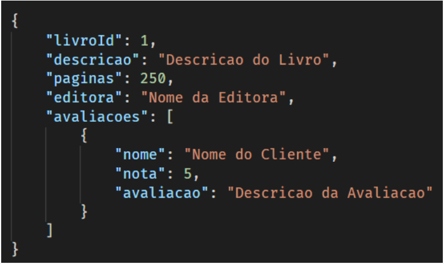

# DESAFIO FINAL DO BOOTCAMP NODEJS DA PÓS-GRADUAÇÃO  

  

## Enunciado  

O desafio consiste em desenvolver uma API para controle de uma livraria online. A API deverá gerenciar os cadastros de livros, autores, clientes e vendas. Também deverá gerenciar as informações da página de venda de cada livro com suas informações e avaliações de leitores. Além disso, a API deverá ter controle de acesso aos endpoints, consultando o usuário que deseja fazer a requisição em uma tabela de usuários no banco de dados. Também será preciso desenvolver testes para a aplicação.  

  

## Atividades  

- [🦉] **01 - Criação do banco de dados relacional:**  
   - [🌌] - Tabela: *clientes*  
        - cliente_id(SERIAL, não nulo) – chave primária da tabela. Identificador único do registro, gerado automaticamente.  
        - nome (VARCHAR, não nulo) – nome do cliente.
        - e-mail (VARCHAR, não nulo) – e-mail do cliente. Observação: será utilizado para autenticar o cliente na API, juntamente com o campo de senha.  
        - senha (VARCHAR, não nulo) – senha do usuário.  
        - telefone (VARCHAR, não nulo) – telefone do cliente.
        - endereco (VARCHAR, não nulo) – endereço do cliente.
    
    - [🌌] - Tabela: *autores* 
         - autor_id (SERIAL, não nulo) – chave primária da tabela. Identificador único do registro, gerado automaticamente.  
         - nome (VARCHAR, não nulo) – nome do autor.  
         - e-mail (VARCHAR, não nulo) – e-mail do autor.  
         - telefone (VARCHAR, não nulo) – telefone do autor.  
    
    - [🌌] - Tabela: *livros*  
         - livro_id (SERIAL, não nulo) – chave primária da tabela. Identificador único do registro, gerado automaticamente.  
         - nome (STRING, não nulo) – nome do livro.  
         - valor (NUMERIC, não nulo) – valor do livro.  
         - estoque (INT, não nulo) – estoque do livro.  
         - autor_id (INT, não nulo) – chave estrangeira para a tabela de autores. Faz referência a um autor.  

     - [🌌] - Tabela *vendas*  
          - venda_id (SERIAL, não nulo) – chave primária da tabela. Identificador único do registro, gerado automaticamente.  
          - valor (NUMERIC, não nulo) – valor da venda (pega o valor do livro vendido no momento da venda).    
          - data (DATE, não nulo) – data da venda.  
          - cliente_id (INT, não nulo) – chave estrangeira para a tabela de clientes. Faz referência a um cliente.  
          - livro_id (INT, não nulo) – chave estrangeira para a tabela de livros. Faz referência a um livro.

   

- [🦉] **02 - Criação do banco de dados NoSQL:**  
      - A propriedade “livroId” serve para manter uma referência do id do livro do banco relacional. As propriedades “descricao”, “páginas” e “editora” dizem respeito ao livro em questão. A propriedade “avaliacoes" é uma lista de avaliações realizadas pelos clientes, possuindo o nome do cliente, a nota dada por ele e a descrição da sua avaliação.    
      

 

- [] **03 - Desenvolvimento dos endpoints:**   
     - [] ***01 - Enpoints do Cliente***:  
       - [😎] 01 - Cadastrar um cliente:  
           - Método HTTP e URL: POST - http://localhost:3000/cliente  
           - Parâmetros: objeto JSON com o nome, e-mail, senha, telefone e endereço do cliente.

       - [😎] 02 - Atualização de um cliente:  
           - Método HTTP e URL: PUT - http://localhost:3000/cliente  
           - Parâmetros:  objeto JSON com o id do cliente que será atualizado, o nome, email, senha, telefone e endereço que serão atualizados.  

       - [😎] 03 - Exclusão de um cliente:  
           - Antes de excluir um cliente, verificar se existem vendas cadastradas para ele. Caso exista, bloquear a exclusão.
           - Método HTTP e URL:  DELETE - http://localhost:3000/cliente/{clienteId}  
           - Parâmetros: id do cliente passado diretamente na URL, exemplo de um id de valor 15 passado na URL: http://localhost:3000/cliente/15

       - [] 04 - Consultar os clientes cadastrados:  
           - retornar todos os clientes, com todas as informações exceto o campo de senha, que não deve ser retornado neste endpoint.
           - Método HTTP e URL: GET - http://localhost:3000/cliente 
          
       - [] 05 - Consultar um cliente em específico:  
           - Pegar o id do cliente e retornar um objeto JSON com suas informações, com todas as informações exceto o campo de senha, que não deve ser retornado neste endpoint.
           - Método HTTP e URL:   GET - http://localhost:3000/cliente/{clienteId}  
           - Parâmetros:  id do cliente passado diretamente na URL, exemplo de um id de valor 15 passado na URL: http://localhost:3000/cliente/15  
             

     - [] ***02 - Enpoints do Autor***:  
       - [] 01 - Cadastrar um autor:  
           - Método HTTP e URL: POST - http://localhost:3000/autor  
           - Parâmetros: objeto JSON com o nome, e-mail, telefone e do autor.

       - [] 02 - Atualização de um autor:  
           - Método HTTP e URL: PUT - http://localhost:3000/autor  
           - Parâmetros:   objeto JSON com o id do autor que será atualizado, o nome, e-mail e telefone que serão atualizados. 

       - [] 03 - Exclusão de um autor:  
           - Antes de excluir um autor, verificar se existem livros cadastradas para ele. Caso exista, bloquear a exclusão.
           - Método HTTP e URL:  DELETE - http://localhost:3000/autor/{autorId}  
           - Parâmetros: id do autor passado diretamente na URL, exemplo de um id de valor 15 passado na URL: http://localhost:3000/autor/15

       - [] 04 - Consultar os autores cadastrados:  
           - retornar todos os clientes, com todas as informações.
           - Método HTTP e URL: GET - http://localhost:3000/autor 
          
       - [] 05 - Consultar um autor em específico:  
           - Pegar o id do autor e retornar um objeto JSON com suas informações.
           - Método HTTP e URL:   GET - http://localhost:3000/autor/{autorId}  
           - Parâmetros:  id do autor passado diretamente na URL, exemplo de um id de valor 15 passado na URL: http://localhost:3000/autor/15  
               

     - [] ***03 - Enpoints do Livro***:  
       - [] 01 - Cadastrar um livro:  
           - Método HTTP e URL: POST - http://localhost:3000/livro  
           - Parâmetros: objeto JSON com o nome, valor e id do autor, que são utilizados para salvar o registro no PostgreSQL. Os demais registros que são inseridos na collection “livroInfo” serão inseridos em outro endpoint. 

       - [] 02 - Atualização de um livro:  
           - Método HTTP e URL: PUT - http://localhost:3000/livro  
           - Parâmetros:   objeto JSON com o id do livro que será atualizado, o valor do livro que será atualizado. O endpoint não deve permitir que o nome e autor do livro sejam alterados, evitando assim possíveis inconsistências.   

       - [] 03 - Exclusão de um livro:  
           - Antes de excluir um livro, verificar se existem vendasrealizadas para ele. Caso exista, bloquear a exclusão.
           - Método HTTP e URL:  DELETE - http://localhost:3000/autor/{livroId}  
           - Parâmetros: id do autor passado diretamente na URL, exemplo de um id de valor 15 passado na URL: http://localhost:3000/autor/15

       - [] 04 - Consultar um livro em específico:  
           - Pegar o id do livro e retornar um objeto JSON com suas informações.
           - Método HTTP e URL:   GET - http://localhost:3000/livro/{livroId}  
           - Observações: retornar as informações do PostgreSQL e do MongoDB. Este endpoint seria utilizado na aplicação web quando o usuário selecionasse um livro em específico na listagem, sendo redirecionado para a página dele, com todas as suas informações e avaliações. 
           - Parâmetros:  id do livro passado diretamente na URL, exemplo de um id de valor 15 passado na URL: http://localhost:3000/livro/15  

       - [] 05 - Consultar os livros cadastrados:  
           - Retornar todos os livros, com todas as informações.
           - Método HTTP e URL: GET - http://localhost:3000/autor 
           - Observações: este endpoint e o próximo devem retornar somente os dados do banco relacional, pois eles serão utilizados somente na listagem dos livros. Caso o usuário queira detalhar mais informações a respeito de um livro em específico, estes dados são obtidos no endpoint anterior.

       - [] 06 - Consultar os livros cadastrados de um autor em específico:  
           - Pegar o id do autor na URL e retornar uma lista de seus livros, sendo cada venda representado por um objeto JSON com todas as propriedades.
           - Método HTTP e URL: GET - http://localhost:3000/livro?autorId={autorId} 
           - Parâmetros: id do livro passado diretamente na URL, exemplo de um id de valor 15 passado na URL: http:/ localhost:3000/livro?autorId=15 (Sugestão: pode ser usada a mesma estrutura do endpoint do item 5, que consulta todos os livros, só que aqui nesse caso ele receberia um parâmetro para filtrar o autor).

       - [] 07 - Cadastrar informações do livro:   
           - Método HTTP e URL: POST – http://localhost:3000/livro/info 
           - Parâmetros: objeto JSON com o “livroId” do livro que terá as informações cadastradas e as propriedades a serem salvas no MongoDB.

       - [] 08 - Atualizar informações do livro:   
           - Método HTTP e URL: PUT – http://localhost:3000/livro/info 
           - Parâmetros: objeto JSON com o “livroId” do livro que terá as informações atualizadas, e as propriedades a serem salvas no MongoDB.

       - [] 09 - Excluir informações do livro:   
           - Método HTTP e URL: DELETE - http://localhost:3000/livro/info/{livroId}
           - Parâmetros:  id do livro passado diretamente na URL, exemplo de um id de valor 15 passado na URL: http://localhost:3000/livro/info/15.

       - [] 10 -Cadastrar uma avaliação:  
           - Método HTTP e URL: POST – http://localhost:3000/livro/{livroId}/avaliacao 
           - Observações: este endpoint deverá buscar no MongoDB o registro referente ao livro em questão pela propriedade “livroId” e inserir a avaliação no array de avaliações.

       - [] 11 - Excluir uma avaliação:  
           - Método HTTP e URL: DELETE - http://localhost:3000/livro/{livroId}/avaliacao/{index}
           - Parâmetros: id do livro que terá a avaliação excluída e o índice da avaliação que será excluída (como é um array, o primeiro elemento é o 0). Exemplo de um id de livro 15 e índice da avaliação 0 passado na URL: http://localhost:3000/livro/15/avaliacao/0
               

     - [] ***03 - Enpoints da Venda***:  
       - [] 01 - Cadastrar uma venda:  
           - Método HTTP e URL: POST - - http://localhost:3000/venda  
           - Parâmetros:  objeto JSON com a data em que a venda foi realizada, o id do cliente que comprou o livro e o id do livro comprado. O valor da venda neste endpoint é buscada da tabela do livro e inserida no registro da venda. A ideia desta ação é salvar o valor exato do livro no momento da venda, evitando que futuras alterações no valor de um livro impacte nas vendas já realizadas daquele livro.  
           - Observação: antes de cadastrar a venda é necessário verificar se o livro tem estoque maior que zero. Se tiver, o endpoint deve permitir a inserção do registro e deve atualizar o estoque do livro, diminuindo em uma unidade. Se não tiver estoque, um erro deve ser retornado ao usuário informando o que ocorreu.

       - [] 02 - Consultar um livro em específico:  
           - Pegar o id  da venda e retornar um objeto JSON com suas informações.
           - Método HTTP e URL:   GET - - http://localhost:3000/venda/{vendaId}   
           - Parâmetros:   id da venda passada diretamente na URL, exemplo de um id de valor 15 passado na URL: http://localhost:3000/venda/15  

       - [] 03 - Consultar as vendas:  
           - Retornar todos os vendas.
           - Método HTTP e URL: GET - http://localhost:3000/venda

       - [] 04 -  Consultar as vendas de um cliente em específico:  
           - Pegar o id do cliente na URL e retornar uma lista das suas vendas, sendo cada venda representado por um objeto JSON com todas as propriedades.
           - Método HTTP e URL: GET - http://localhost:3000/venda?clienteId={clienteId} 
           - Parâmetros: id do venda passado diretamente na URL, exemplo de um id de valor 15 passado na URL:  http://localhost:3000/venda?clienteId=15 (Sugestão: pode ser usada a mesma estrutura do endpoint do item 3, que consulta todas as vendas, só que aqui nesse caso ele receberia um parâmetro para filtrar o cliente).  

       - [] 05 -  Consultar as vendas de um livro em específico:  
           - Pegar o id do livro na URL e retornar uma lista das suas vendas, sendo cada venda representado por um objeto JSON com todas as propriedades.
           - Método HTTP e URL: GET - http://localhost:3000/venda?livroId={livroId} 
           - Parâmetros: id do venda passado diretamente na URL, exemplo de um id de valor 15 passado na URL:   http://localhost:3000/venda?livroId=15 (Sugestão: pode ser usada a mesma estrutura do endpoint do item 3, que consulta todas as vendas, só que aqui nesse caso ele receberia um parâmetro para filtrar o livro).

       - [] 06 -  Consultar as vendas de um autor em específico:  
           - Pegar o id do livro na URL e retornar uma lista das suas vendas, sendo cada venda representado por um objeto JSON com todas as propriedades.
           - Método HTTP e URL: GET - http://localhost:3000/venda?autorId={autorId} 
           - Parâmetros: id do livro passado diretamente na URL, exemplo de um id de valor 15 passado na URL:   http://localhost:3000/venda?livroId=15 (Sugestão: pode ser usada a mesma estrutura do endpoint do item 3, que consulta todas as vendas, só que aqui nesse caso ele receberia um parâmetro para filtrar o livro).

             

